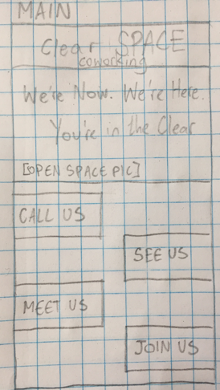

# Clear Spot - Design Project

###### Mock website design based on example client desires

#### By **Travis Toal**

### Description

* _This project is an exercise in the design process, from defining the target users, to creating wireframes, to navigable prototypes, and finally to a coded, live site._

### Target Users

* _Potential coworkers can get a feeling of openness - both physical and mental - from the site, and can get information about how to join the workspace. Minimal text-blocks and stuff in your face. It feels high-end, but not exclusive._

* _The clients' personalities are reflected in the site - the company is not soulless, but warm, quirky, and connected to their Portland roots - definitely not your traditional corporation._

* _Non-technical folk will feel welcome and represented in the company, as opposed to a code-focused site._

* _Social clients can see the many modern amenities and luxuries the company has, and the group activities they would have access to if they join the space._

### User Personas / Stories

#### Derek
##### "As a modern professional, I want to feel like I'm in the forefront of the field."
###### Needs
* _Clean, polished site_
* _A company with high-tech amenities_

###### Pain Points
* _Companies that require clients to provide all amenities_
* _Clunky, busy sites_

###### How we can serve
* _Make it 'cool,' minimalistic and soft._
* _Showcase the many technologies the space contains._

#### Sharon
##### "I don't want to lose sight of *who I am* when I go to work."
###### Needs
* _A space to work_
* _Freedom of expression_
* _Feeling of community_

###### Pain Points
* _Companies where all employees feel the same - no diversity in personality or in background_
* _Workplaces that don't offer any recreational activities to break up the monotony of the day_
* _Boxy, confined areas_

###### How we can serve
* _Showcase the welcoming and adaptable spirit of the space._
* _Display how the company differs from the monocultured giants in the field._
* _Show the weekly activities._
* _Show the wide, open spaces in the office_

#### Carol
##### "As a businessperson, I don't want to feel alienated from the tech crowd."
###### Needs
* _A local workplace_
* _A feeling of representation_

###### Pain Points
* _Over-technical sites and jargon_

###### How we can serve
* _Cater the site to a wide crowd, not to any one occupation._

### Research
* _Similar sites include WeWork, Techspace, Regus, Proximity, CO+HOOTS, Workbar, Nextspace, Bond Collective, and NGIN Workplace._

* _Techspace, Regus and Nextspace are examples of the things I *don't* want in my project -- busy, word-heavy, claustrophobic sites that drive me away._

* _My three biggest inspirations out of these similar companies are the Bond Collective, CO+HOOTS, and Workbar, for their minimalistic content, aesthetic style, and user experience, respectively._

* _I want to incorporate Bond Collective's stylistic choices into my product. They let their product speak for itself -- not a wall of text, but simple pictures and icons for the most part, a sleek, modern site with a lot of breathing room, which gives off the right vibes for the comfortable, casual environment of Clear Space._

* _A complaint I have with most *all* of these sites is the fact that they try to shove everything into the landing page, forcing the user to scroll excessively to find the information they want. In my design, I want to keep the page feeling light and concise. A small header, a picture showcasing the area with minimal text, and tabs to the contact, amenities, location, and subscription pages. No need to scroll, even on the smallest screens, and the layout to the whole site is presented to the user, without being overly busy._

## Sketches

* _Landing Page_

## Technologies Used

* _Sketch, v50.2_

### Setup / Installation Requirements

### Known Bugs

### Support and Contact Details

#### License
* _This software is licensed under the MIT license_

Copyright (c) 2019 **Travis Toal**
